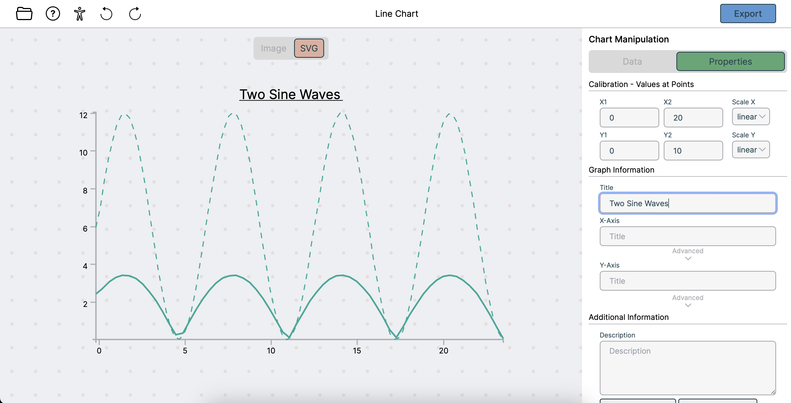
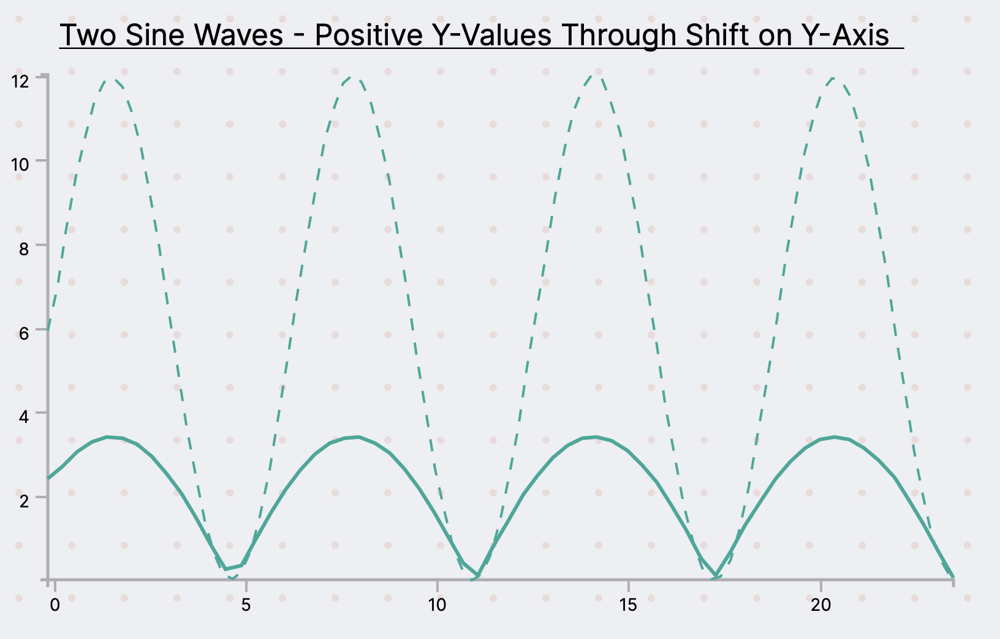

## Chart4Blind
As I was still really into web-development in my Bachelor's degree and I wanted my Bachelor's thesis to add value, I produced a tool to help digitize charts for Blind and Visually Impaired (BVI) individuals. This project made it all the way to [ACM Conference on Intelligent User Interfaces (IUI) 2024](https://dl.acm.org/doi/10.1145/3640543.3645175) where it was presented live in South Carolina, USA! The code is available [here](https://github.com/Morris-be/Chart4Blind/).
### Abstract
In a world driven by data visualization, ensuring the inclusive accessibility of charts for Blind and Visually Impaired (BVI) individuals remains a significant challenge. Charts are usually presented as raster graphics without textual and visual metadata needed for an equivalent exploration experience for BVI people. Additionally, converting these charts into accessible formats requires considerable effort from sighted individuals. Digitizing charts with metadata extraction is just one aspect of the issue; transforming it into accessible modalities, such as tactile graphics, presents another difficulty. To address these disparities, we propose Chart4Blind, an intelligent user interface that converts bitmap image representations of line charts into universally accessible formats. Chart4Blind achieves this transformation by generating Scalable Vector Graphics (SVG), Comma-Separated Values (CSV), and alternative text exports, all comply with established accessibility standards. Through interviews and a formal user study, we demonstrate that even inexperienced sighted users can make charts accessible in an average of 4 minutes using Chart4Blind, achieving a System Usability Scale rating of 90%. In comparison to existing approaches, Chart4Blind provides a comprehensive solution, generating end-to-end accessible SVGs suitable for assistive technologies such as embossed prints (papers and laser cut), 2D tactile displays, and screen readers.

### Features
- A user is provided tools to convert an input image of a Line Chart
- Manual Input of Data Points on Chart
- Automatic Input of Data Points on Chart (With additional backend)
- SVG and CSV output
- OCR tool for Labels, Axis and descriptions entry
- Guided tour
- Snackbar for feedback
- SVG and CSV stored on server as training data if consent given (With additional backend)
### Screenshots

Final output printed on Braille embossing paper:

The Figma prototype of the entire application:
