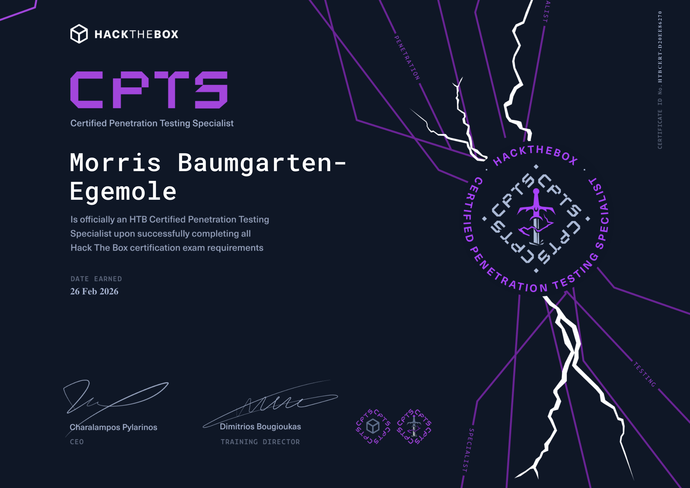

## HTB Certified Penetration Testing Specialist (HTB CPTS)
The Certified Penetration Testing Specialist (CPTS) by Hack The Box was one of the most fun yet challenging certifications I’ve taken.

Since I love to challenge myself, I would have jumped straight into the exam, this time, I'm glad this was not an option. Before the exam can be taken, a course that HTB estimates takes about 6 months must be completed in full. As I spent a huge amount of time on the material and took some notes I'm sure I'll go back to for years to come, I was able to significantly reduce the amount of time I took to prepare.

I clicked "start," and the exam began. That’s when things really escalated.

The exam was an intense 10-day back-and-forth. I dedicated six of those days purely to grinding the environment. I enumerated for hours, escalated privileges, and pivoted, all while documenting my process. It was demanding, but in the best way possible. I was impressed by the lab environment, especially its size.

To ensure I followed all the guidelines set by Hack The Box, my final report ended up being an insane 120 pages. While this is definitely not typical for penetration tests, I'm proud of how detailed I was able to make the report, all while always focusing on what is important: trying to recommend to the hypothetical client how the findings can be mitigated.

Overall, CPTS pushed me hard, but it was incredibly enjoyable.
### Certificate

Check out my badge on Credly: [here](https://www.credly.com/badges/50af401b-97d3-4028-87b8-15b83764fcd9/public_url) 