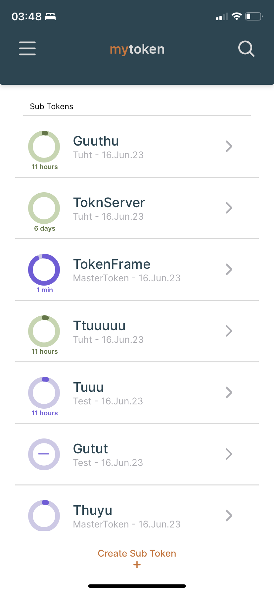
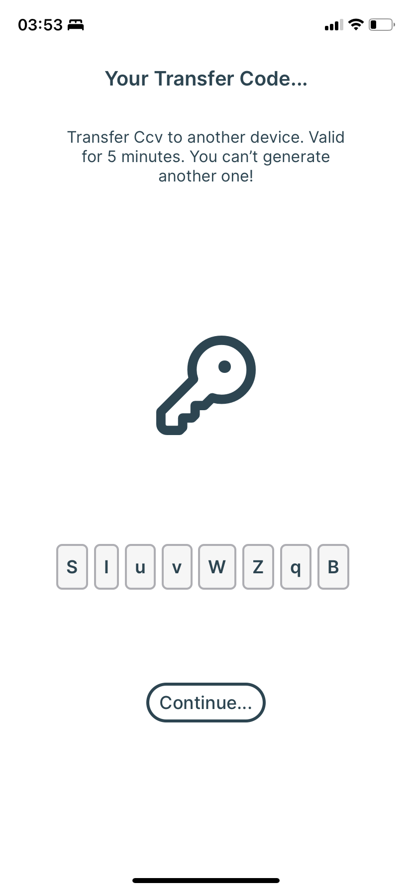
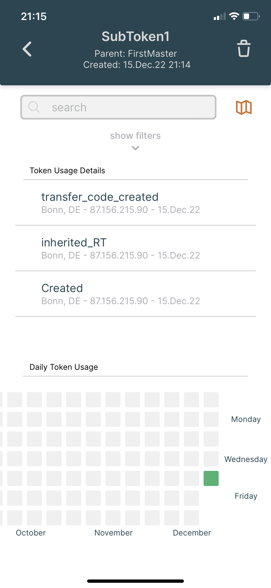
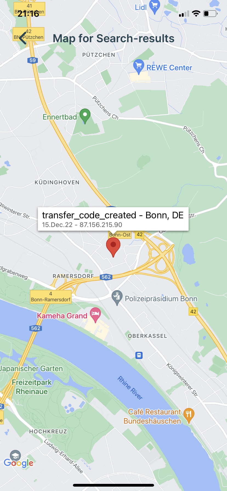
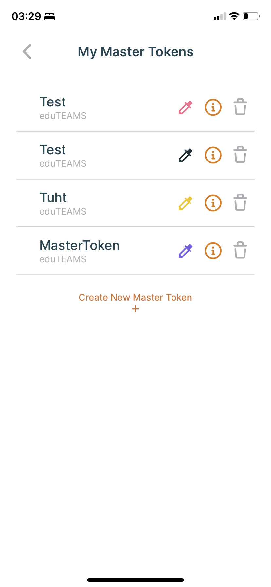
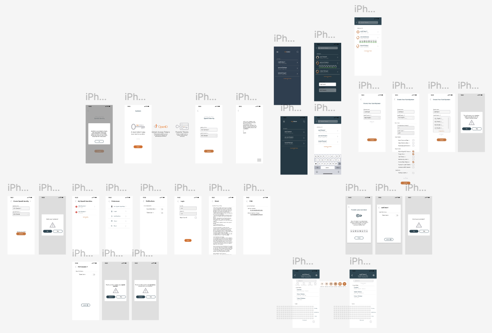

## Mytoken App
Mytoken is a web service to obtain OpenID Connect Access Tokens in an easy but secure way for extended periods of time and across multiple devices made by Gabriel Zachmann [Read more](https://mytoken-docs.data.kit.edu).
The mobile app was created in the course of my HiWi job and allows users to manage-, create-, delete- and view details of- mytokens. The app, through a simple, minimalistic design, guides the user through the process of creating and transferring their mytokens.

Within the app, users must authenticate providers. These are confirmed externally through the online OpenID provider. To do this, the app automatically redirects the user to their smartphones' browser when authentication is required. When created, the authentication token is encrypted and stored in the persistent storage of the device. All tokens created with authenticated providers are shown within the app. Also, using an authenticated provider, users can create new tokens. Creating new tokens does not require an external authentication step.

After creation, the user is presented a transfer code that's valid for 5 minutes. Only the authentication for the provider requires storing a token on the device. 

The powerful provider token is used to fetch details about a tokens usage. These details are visualized using text, charts and maps.
### Features
- Works with Android and IOS
- Authenticate Providers
- View all tokens made for a provider
- Create customized new tokens
- Loading indicator for token expiration date
- Customize colors for each provider
- View token usage history
- App secured using AES encryption, SHA3 hashing and a user-set password
- filter token history with toggles
- search token and token usage history
- View token usage (ip) on a map (GeoIP Maxmind Server)
- Use predefined templates to configure tokens during creation
- Choose any mytoken domain
### Screenshots
  
The Figma prototype of the entire application:
