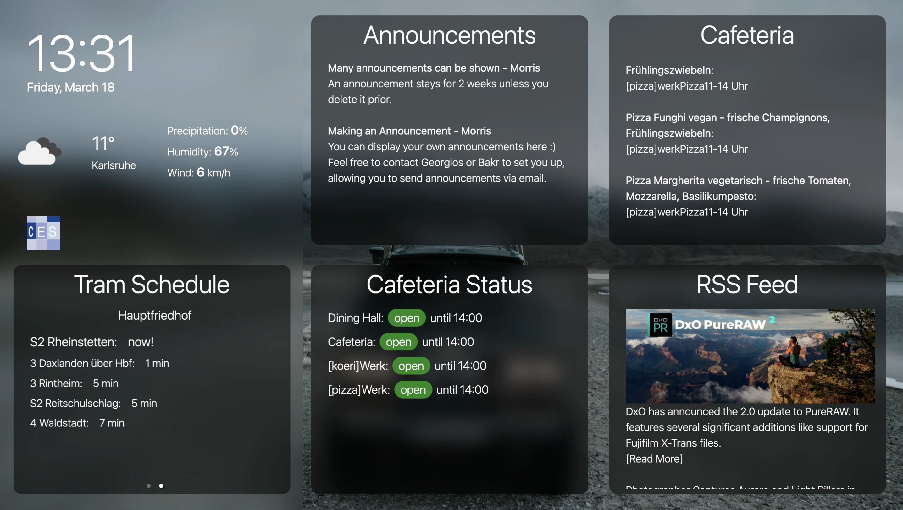
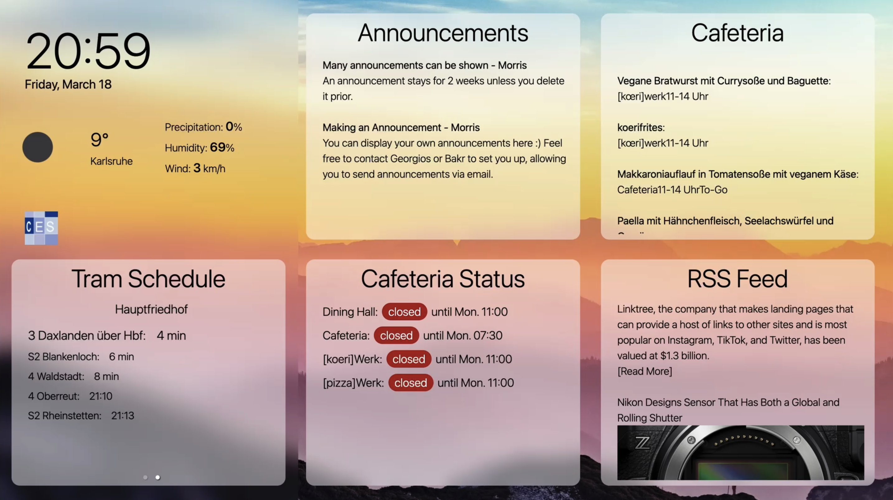
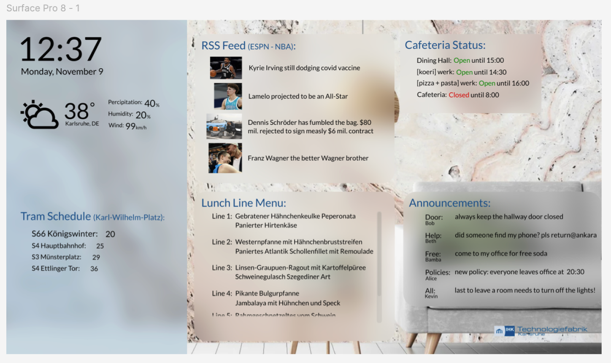

## Smart TV Dashboard 
This was a really fun group project in the course of my degree. We were a group of 5 where we distributed work to achieve the final product: a Smart TV Dashboard. 

I was in charge of the front-end development, including designing the prototype in Figma, and then implementing this prototype using Typescript and React. I also designed the widgets that did not require a backend which is what the other team-members were working on. The code is available [here](https://github.com/penta-skill-experience/kit-smart-tv/).
### Screenshots
View from the widget based dashboard. Widgets scroll dynamically and a carousel can be configured with more widgets from an admin panel. The theme and background can also be adjusted from said panel.

The Figma Prototype:

